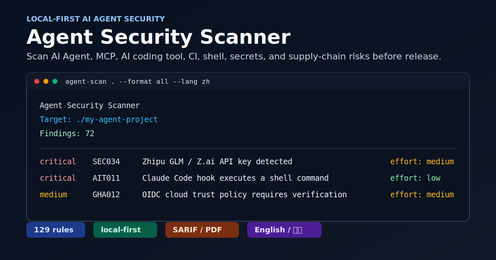

# Agent Security Scanner 中文介绍

**当前版本：V1.0.1**

[English README](README.md)

[](https://www.python.org/)
[](docs/RULES_zh.md)
[](#为什么值得关注)
[](#输出矩阵)
[](LICENSE)

`agent-security-scanner` 是一个本地优先的 AI Agent、MCP 和 AI 编程工具安全扫描器。它用于扫描危险权限、明文 token、可疑 Shell 命令、过宽文件访问、GitHub Actions 自动化风险，以及常见 AI 编程工具配置风险。

工具默认只在本地读取和分析文件，不上传源码、密钥或扫描结果，适合用于个人项目、企业内部代码库、开源发布前检查、CI 安全门禁和 AI 编程工具配置审查。



## 为什么值得关注

AI 编程工具和 Agent 框架改变了本地开发安全模型：一个项目里现在可能包含工具权限、MCP Server、Hook、记忆文件、指令文件、工作流自动化和模型服务凭据，这些内容会直接影响 AI 助手能读取什么、执行什么、把什么发送到外部。

这个项目聚焦的正是这层新的攻击面：

- **AI 原生检查**：覆盖 MCP、Claude Code、Cursor、Codex、Continue、Roo Code、Cline、Gemini CLI、AGENTS.md、CLAUDE.md、SKILL.md 等本地 Agent 文件。
- **主流 AI 服务商密钥覆盖**：覆盖 OpenAI、Anthropic、DeepSeek、Kimi、Qwen/DashScope、智谱 GLM、豆包/Seedance、MiniMax、百川、硅基流动、ModelScope 等。
- **适合发布和审计的报告**：支持终端、JSON、SARIF、Markdown、Excel、PDF，并按英文、中文、机器可读结果分目录输出。
- **适合 CI 和存量项目接入**：支持 `--fail-on`、SARIF、规则文档生成、baseline 模式和中英双语输出。

## V1.0.1 修复

V1.0.1 修复了交互式 CLI 的报告目标目录问题：扫描其他目录后，选项 3 和选项 4 会默认使用上次扫描的项目目录，确保生成报告和终端中刚查看的扫描结果一致。

## 30 秒快速开始

从 PyPI 安装：

```bash
python -m pip install agentsec-scanner
```

或从仓库安装：

```bash
git clone https://github.com/LeeBush22/agent-security-scanner.git
cd agent-security-scanner
python -m pip install .
```

扫描当前项目：

```bash
agent-scan .
```

一次生成中英文多格式报告：

```bash
agent-scan . --format all
```

使用中文输出：

```bash
agent-scan . --lang zh
```

## 规则覆盖概览

| 攻击面 | 规则数 | 主要检查内容 |
|---|---:|---|
| Secrets | 53 | AI 服务商 Key、云服务 Key、平台 Token、私钥、数据库 URL、JWT、高熵凭据 |
| MCP | 18 | 过宽文件访问、远程 MCP 认证缺失、stdio 隔离缺失、工具名冲突、OAuth Redirect 风险 |
| AI 编程工具 | 17 | 自动批准、权限绕过、Claude Hooks、动态 Shell 指令、Base URL 覆盖、不安全记忆/规则 |
| 供应链 | 16 | 安装脚本、包管理凭据、远程依赖、Docker/devcontainer 风险、`binding.gyp`、`setup.py` |
| GitHub Actions | 12 | 权限过宽、未固定 Action、`pull_request_target`、OIDC、artifact/cache 信任链 |
| Shell | 10 | `curl | bash`、破坏性命令、反弹 Shell、编码执行、包管理器下载后立即执行 |

## 输出矩阵

| 格式 | 适用场景 | 输出位置 |
|---|---|---|
| Terminal | 本地快速查看 | 终端 |
| JSON | 自动化和自定义流水线 | `output/machine/report.json` |
| SARIF | GitHub Code Scanning 和安全平台 | `output/machine/agent-scan.sarif` |
| Markdown | PR 评论和人工报告 | `output/en/report.md`、`output/zh/report.md` |
| Excel | 审计分拣和表格复核 | `output/en/report.xlsx`、`output/zh/report.xlsx` |
| PDF | 可分享的审计风格报告 | `output/en/report.pdf`、`output/zh/report.pdf` |

## 与传统工具的区别

| 工具类型 | 擅长内容 | 本项目补足的空白 |
|---|---|---|
| Secrets 扫描器 | 发现通用已提交凭据 | AI 服务商上下文、OpenAI 兼容代理 Key、MCP/Agent 配置密钥 |
| SAST 工具 | 代码级漏洞 | 本地 AI 工具权限、Prompt/指令文件、Hook、MCP 路由、自动化配置 |
| CI Linter | 工作流语法和规范 | GitHub Actions 安全风险、OIDC 核验提示、artifact/cache 信任链 |
| 容器扫描器 | 镜像和依赖风险 | 源码侧 Docker/devcontainer 主机路径暴露和下载脚本执行 |

Agent Security Scanner 不是成熟 SAST、依赖扫描或云安全产品的替代品。它是一个专门覆盖 AI Agent 和 AI 编程工具本地安全层的补充工具。

## 这个工具到底扫描什么

Agent Security Scanner 扫描的是一个**本地项目目录**。它不是系统漏洞扫描器，不是网站扫描器，也不是杀毒软件；它的作用是读取你指定目录里的文件内容，找出 AI Agent、MCP、AI 编程工具和自动化脚本中常见的安全风险。

这里的“项目目录”通常就是一个软件项目或代码仓库的根目录，例如：

```text
my-agent-project/
├─ main.py
├─ requirements.txt
├─ .env
├─ mcp.json
├─ config.yaml
├─ .github/
│  └─ workflows/
│     └─ ci.yml
├─ scripts/
│  └─ install.sh
└─ README.md
```

也就是说，你应该把扫描器指向**包含代码、配置、脚本、工作流和 AI 工具设置的目录**。这个目录可以是 Python 项目、前端项目、Java 项目、C/C++ 项目、AI Agent 项目、MCP Server 项目，或者包含 GitHub Actions 自动化流程的代码仓库。

可以扫描的目录示例：

```text
D:\Projects\Python_Project\某个项目
D:\Projects\Java_Project\某个项目
D:\Projects\C_Project\某个项目
D:\Projects\AI_Agent_Project\某个项目
D:\Projects\MCP_Server\某个项目
```

如果你已经进入了项目根目录，可以扫描当前目录：

```powershell
agent-scan .
```

如果要扫描其他项目，可以输入完整路径：

```powershell
agent-scan D:\Projects\Python_Project\my-agent-project
```

在交互式菜单中，“扫描当前目录”指的是你当前终端所在的目录。如果提示你输入“项目目录”，直接回车或输入 `.` 都表示当前目录；如果要扫描其他项目，则输入那个项目的完整路径。不要输入“当前”两个字，因为工具会把它当作一个真实文件夹名。扫描其他目录后，生成报告类操作会默认使用上次扫描目录，直接回车即可让报告内容和刚刚查看的扫描结果保持一致。

它会重点扫描这些文件：

- 代码文件。
- `.env` 文件和本地配置文件。
- JSON、YAML、TOML、INI 等配置文件。
- Shell、PowerShell、Batch 脚本。
- MCP 配置文件。
- Cursor、Claude Code、Codex、Continue、Roo Code、Cline 等 AI 编程工具配置。
- `.github/workflows/` 下的 GitHub Actions 工作流。
- README 或文档中出现的可执行命令。

它主要查找这些风险：

- 明文 API Key、平台 Token、私钥、带密码的数据库 URL、JWT、高熵凭据和值类似凭据。
- 危险 Shell 命令，例如递归强制删除、`curl | bash`、PowerShell 动态执行、编码命令、反弹 Shell、破坏性磁盘命令、关闭安全控制、疑似密钥外传。
- MCP 文件系统访问范围过宽。
- MCP Server 使用危险参数、明文环境变量、远程端点、明文 HTTP、私有网络或 metadata 地址、过宽 scope、凭据透传、敏感本地路径、过宽可写文件访问、工具/资源描述投毒、工具输出被当作指令、远程 Prompt 注入等风险。
- GitHub Actions 中的 `pull_request_target`、未固定 Action、workflow/job 权限过宽、不可信表达式注入、OIDC 权限暴露、cache/artifact 投毒、`workflow_run` artifact 提权链、输出 Secret、下载脚本后执行、自托管 Runner 等风险。
- AI 编程工具中的自动批准、跳过权限检查、工作区访问过宽、可调用 Shell、配置里写入明文凭据、Agent 指令文件中的危险提示词、记忆/规则投毒、过度自治、数据外传指令、高风险工具组合等风险。
- 供应链配置风险，例如包安装脚本、远程依赖来源、包管理器明文凭据、Docker 构建下载脚本、特权容器、敏感主机挂载、devcontainer 生命周期命令、未固定 Python 依赖等。

你不需要专门创建一个空目录给它扫描。正确用法是：把它指向你已有的真实项目源码目录，用来在开发、发布、开源或接入 CI 前做一次本地安全检查。

## 当前能力

| 能力 | 说明 |
|---|---|
| 交互式 CLI | 无参数运行 `agent-scan` 可进入美化版原生终端菜单，长内容使用 Windows/PowerShell 窗口滚动 |
| 中英双语 | 支持 `--lang en` / `--lang zh` 和配置文件默认语言 |
| 子命令 | 支持 `scan`、`init`、`doctor`、`rules`、`report` |
| 文件扫描 | 递归扫描文本文件，并跳过 `.git`、`.venv`、`node_modules`、`output` 等目录 |
| Secrets 检测 | 检测 OpenAI、Anthropic、Gemini/Google、DeepSeek、Groq、xAI/Grok、Perplexity、OpenRouter、Together AI、Fireworks AI、Mistral、Cohere、Replicate、Azure OpenAI、NVIDIA NIM/NGC、Stability AI、ElevenLabs、Voyage AI、Tavily、智谱 GLM、Kimi/Moonshot、豆包/Seedance/火山方舟、通义千问/Qwen/DashScope/百炼、百度千帆、腾讯混元、讯飞星火、MiniMax、百川、零一万物/01.AI/Yi、阶跃星辰、硅基流动、商汤日日新、360 智脑、魔搭 ModelScope、无问芯穹 Infini-AI、生数 Vidu、快手可灵 Kling AI、OpenAI-compatible 代理 Key、AK/SK 组合密钥、GitHub、AWS、Slack、Discord、Hugging Face、npm、PyPI、Stripe、Azure Storage、Bearer Token、JWT、数据库 URL、通用高熵凭据、私钥块等 |
| 服务商感知密钥检测底座 | 支持按服务商、别名、变量名、域名、Token 前缀和上下文关键词扩展 AI API Key 检测规则 |
| MCP 配置检测 | 检测过宽文件访问、危险命令、远程 MCP、远程认证缺失、stdio Server 缺少明显隔离、工具名冲突、OAuth redirect URI 不安全、明文 HTTP、私有或 metadata 地址、过宽 scope、凭据透传、敏感本地路径、过宽可写路径、工具/资源描述投毒、远程 Prompt 注入、明文环境变量和危险参数 |
| AI 编程工具检测 | 检测 Cursor、Claude Code、Codex、Continue、Roo Code、Cline、Gemini CLI、AGENTS.md、CLAUDE.md、SKILL.md、memory/rule 文件、Cursor rules、GitHub Copilot instructions、Claude Code hooks、不可见 Unicode 指令隐藏、动态 Shell 语法、AI API Base URL 覆盖、VS Code folderOpen 自动任务、未固定版本的技能引用等配置和指令风险 |
| Shell 命令检测 | 检测 `rm -rf`、`curl | bash`、PowerShell 动态执行、EncodedCommand、反弹 Shell、破坏性磁盘命令、关闭沙箱、内联动态代码、包管理器即执行、疑似外传等 |
| GitHub Actions 检测 | 检测 `pull_request_target`、未固定 Action、workflow/job 权限、表达式注入、OIDC 权限暴露、OIDC 云侧信任策略核验提示、cache/artifact 投毒、`workflow_run`、Secret 输出、自托管 Runner |
| 供应链检测 | 检测 `package.json`、包管理器认证文件、Dockerfile、Docker Compose、devcontainer、Python requirements、`binding.gyp` 命令替换、`setup.py` 安装期可疑命令执行等供应链配置风险 |
| 多格式报告 | 支持终端、JSON、Markdown、SARIF、Excel、PDF |
| 分目录输出 | 英文报告、中文报告和机器报告分别写入 `en/`、`zh/`、`machine/` |
| SARIF 元数据 | SARIF 规则包含分类、严重等级、precision、tags 和规则帮助链接 |
| 规则文档 | 可生成 `docs/RULES.md` 和 `docs/RULES_zh.md` 两份规则索引 |
| 发布质量检查 | `doctor` 会检查规则 ID 唯一性、前缀/分类一致性、元数据完整性和扫描器规则登记状态 |
| Baseline 模式 | 支持记录既有问题，只报告新增风险 |
| CI 门禁 | 支持 `--fail-on` 按严重等级返回非零退出码 |

## 安装

在项目目录中创建虚拟环境并安装开发依赖：

```powershell
python -m venv .venv
.\.venv\Scripts\python.exe -m pip install -e ".[dev]"
```

如果 Windows 非 ASCII 路径导致 editable install 异常，可以使用普通安装：

```powershell
.\.venv\Scripts\python.exe -m pip install ".[dev]"
```

检查版本：

```powershell
.\.venv\Scripts\agent-scan.exe --version
```

## 快速使用

启动美化版原生终端交互式菜单：

```bash
agent-scan
```

默认交互模式使用 Rich 美化的原生终端输出：包含顶部图标、欢迎说明、响应式菜单、彩色表格和清晰的输出分隔线。顶部图标和欢迎区只在启动、输入 `r` 重绘首页、以及切换语言后展示；其他操作结束返回主菜单时，只显示紧凑的交互式菜单。它不会进入全屏备用屏幕，因此规则列表、doctor 结果和扫描结果等长内容会保留在终端滚动历史中；在 Windows PowerShell 或 Windows Terminal 中，可以直接使用窗口右侧原生滚动条或鼠标滚轮查看上方内容。界面每次绘制时都会读取当前窗口宽度；调整窗口大小后输入 `r` 可以按新尺寸重绘首页，执行操作并返回时会显示按当前窗口适配的紧凑菜单。可以输入数字或命令执行操作；进入子操作后输入 `back`、`q`、`exit` 或 `esc` 返回上一级，主菜单输入 `q` 或 `exit` 退出。

短命令别名也可用：

```bash
agentsec
```

扫描当前目录：

```bash
agent-scan .
```

显式子命令写法：

```bash
agent-scan scan .
```

输出 JSON：

```bash
agent-scan . --format json
agent-scan scan . --format json
```

切换为中文 CLI：

```bash
agent-scan . --lang zh
agent-scan scan . --lang zh
agent-scan doctor --lang zh
agent-scan rules --lang zh
agent-scan report --lang zh
```

生成中文和英文 Markdown 报告：

```bash
agent-scan . --format markdown
```

一次生成所有报告：

```bash
agent-scan . --format all
```

默认会写入：

```text
output/
├─ en/
│  ├─ report.md
│  ├─ report.xlsx
│  └─ report.pdf
├─ zh/
│  ├─ report.md
│  ├─ report.xlsx
│  └─ report.pdf
└─ machine/
   ├─ agent-scan.sarif
   └─ report.json
```

其中 `en/` 是英文人工阅读报告，`zh/` 是中文人工阅读报告，`machine/` 用于 SARIF、JSON 等机器读取报告。

中文 Markdown、Excel 和 PDF 报告会使用中文规则标题、中文修复建议、中文修复摘要和中文修复步骤，不再混用英文修复内容。PDF 报告采用正式审计报告风格：总标题、一级标题和表头使用统一蓝色展示，摘要中的风险等级统计和风险类型统计合并为一张表，风险发现和修复建议按结构化块展示，便于直接阅读和分享。

## V1.0.0 子命令

| 命令 | 用途 |
|---|---|
| `agent-scan` | 启动美化版原生终端交互式菜单 |
| `agent-scan scan .` | 扫描指定目录 |
| `agent-scan init` | 创建 `.agent-scan.yml` 配置文件 |
| `agent-scan doctor` | 检查 Python 版本、依赖和输出目录权限 |
| `agent-scan rules` | 列出内置扫描规则 |
| `agent-scan report` | 查看 `output/` 中已生成的报告 |

示例：

```bash
agent-scan init
agent-scan doctor
agent-scan rules
agent-scan rules --category mcp
agent-scan rules --format markdown --output docs/RULES.md
agent-scan rules --format markdown --output docs/RULES_zh.md --lang zh
agent-scan report
```

旧用法仍然兼容：

```bash
agent-scan .
agent-scan . --format all
agent-scan . --fail-on high
```

## 交互式菜单

直接运行：

```bash
agent-scan
```

默认会进入美化版原生终端交互菜单，菜单和结果仍是普通终端输出，所有内容都会写入当前终端窗口的滚动历史。窗口变小或变大时，界面会在再次绘制菜单时重新读取终端宽度；如果内容超过当前窗口高度，可以使用 Windows/PowerShell 窗口右侧的原生滚动条或鼠标滚轮查看上方内容。

在交互式模式中，进入某个子操作后可以输入 `back`、`q`、`exit` 或 `esc` 后回车返回上一级菜单。
当输出内容超过当前窗口高度时，不会再生成应用内滚动条；内容会作为普通终端输出保留在系统滚动历史中，直接使用终端窗口自己的滚动功能即可。

菜单中可以完成：

- 扫描当前目录。
- 扫描其他目录。
- 生成全部报告。
- 生成 Excel 和 PDF 报告。
- 初始化 `.agent-scan.yml`。
- 运行 doctor 环境检查。
- 查看内置规则。
- 查看已生成报告。
- 创建或更新 baseline。
- 预览 baseline 门禁结果。
- 在中文和英文之间切换界面语言。

## 配置文件

生成默认配置：

```bash
agent-scan init
```

示例 `.agent-scan.yml`：

```yaml
min_severity: info
language: en

exclude:
  - output/
  - vendor/
  - generated/**

disabled_rules: []
enabled_rules: []

ignore:
  # - rule_id: SEC001
  #   path: examples/sample-project/app.py
  #   reason: Intentional fake key used as a scanner fixture.

max_file_size_bytes: 1000000
```

如果希望默认使用中文 CLI，可以设置：

```yaml
language: zh
```

指定配置文件：

```bash
agent-scan . --config examples/.agent-scan.yml
```

禁用配置文件加载：

```bash
agent-scan . --no-config
```

## CI 和门禁

当发现高危及以上问题时返回退出码 `1`：

```bash
agent-scan . --fail-on high
```

创建 baseline：

```bash
agent-scan . --update-baseline --baseline-output .agent-scan-baseline.json
```

只报告 baseline 中没有的新问题：

```bash
agent-scan . --baseline .agent-scan-baseline.json --fail-on high
```

## 规则分类

| 分类 | 说明 |
|---|---|
| `secrets` | 明文密钥、Token、私钥等敏感信息 |
| `mcp` | MCP Server 配置风险 |
| `shell` | 可疑或危险 Shell 命令 |
| `github-actions` | GitHub Actions 自动化风险 |
| `ai-tool` | AI 编程工具配置风险 |
| `supply-chain` | 供应链配置风险 |

查看规则：

```bash
agent-scan rules
agent-scan rules --category secrets
agent-scan rules --format markdown --output docs/RULES.md
agent-scan rules --format markdown --output docs/RULES_zh.md --lang zh
```

完整规则索引也可以直接查看：

- `docs/RULES.md`
- `docs/RULES_zh.md`

主要内置规则：

| 规则 | 分类 | 等级 | 说明 |
|---|---|---:|---|
| AIT001 | ai-tool | high | AI 编程工具启用自动批准或范围过宽 |
| AIT002 | ai-tool | critical | AI 编程工具绕过权限检查 |
| AIT003 | ai-tool | high | AI 编程工具工作区访问范围过宽 |
| AIT004 | ai-tool | high | AI 编程工具可调用 Shell 命令 |
| AIT005 | ai-tool | critical | AI 编程工具配置中包含明文密钥 |
| AIT006 | ai-tool | high | AI 指令文件中包含不安全指令 |
| AIT007 | ai-tool | high | AI 记忆或规则文件包含持久化危险指令 |
| AIT008 | ai-tool | high | AI 指令授予过度自治能力 |
| AIT009 | ai-tool | critical | AI 指令允许数据外传 |
| AIT010 | ai-tool | high | AI 工具授予高风险工具组合 |
| SEC001 | secrets | critical | OpenAI API Key |
| SEC002 | secrets | critical | GitHub Token |
| SEC003 | secrets | critical | Anthropic API Key |
| SEC004 | secrets | high | Bearer Token |
| SEC005 | secrets | critical | 私钥块 |
| SEC006 | secrets | critical | AWS Access Key |
| SEC007 | secrets | critical | Slack Token |
| SEC008 | secrets | critical | Discord Token 或 Webhook |
| SEC009 | secrets | critical | Hugging Face Token |
| SEC010 | secrets | critical | npm Access Token |
| SEC011 | secrets | critical | PyPI API Token |
| SEC012 | secrets | critical | Stripe API Key |
| SEC013 | secrets | critical | Google API Key |
| SEC014 | secrets | critical | Azure Storage 连接字符串 |
| SEC015 | secrets | high | JWT |
| SEC016 | secrets | high | 数据库 URL 中包含密码 |
| SEC017 | secrets | high | 通用高熵凭据 |
| MCP001 | mcp | high | MCP 文件系统访问范围过宽 |
| MCP002 | mcp | high | MCP 使用可执行 Shell 的命令 |
| MCP003 | mcp | critical | MCP 环境变量中包含明文密钥 |
| MCP004 | mcp | medium | 配置远程 MCP Server |
| MCP005 | mcp | critical | MCP Server 使用危险参数 |
| MCP006 | mcp | high | MCP 远程 Server 使用明文 HTTP |
| MCP007 | mcp | high | MCP 远程端点指向私有或 metadata 地址 |
| MCP008 | mcp | high | MCP 工具 scope 过宽 |
| MCP009 | mcp | medium | MCP 转发主机凭据环境变量 |
| MCP010 | mcp | high | MCP 文件系统访问包含敏感本地路径 |
| MCP011 | mcp | critical | MCP 可写文件系统访问范围过宽 |
| MCP012 | mcp | high | MCP 工具或资源描述包含不安全指令 |
| MCP013 | mcp | high | MCP 工具输出被当作可执行指令 |
| MCP014 | mcp | medium | MCP 资源可能注入远程 Prompt 内容 |
| SH001 | shell | critical | 递归强制删除命令 |
| SH002 | shell | critical | 下载脚本后直接交给 Shell 执行 |
| SH003 | shell | high | 禁用执行安全控制 |
| SH004 | shell | high | 疑似敏感信息外传命令 |
| SH005 | shell | high | 编码命令执行 |
| SH006 | shell | high | PowerShell 动态表达式执行 |
| SH007 | shell | critical | 反弹 Shell 模式 |
| SH008 | shell | critical | 破坏性磁盘或文件系统命令 |
| SH009 | shell | medium | 内联动态代码执行 |
| SC001 | supply-chain | high | 包安装生命周期脚本会自动执行 |
| SC002 | supply-chain | high | 包脚本包含高风险安装或执行命令 |
| SC003 | supply-chain | medium | 包依赖使用远程 Git 或 URL 来源 |
| SC004 | supply-chain | medium | 包依赖版本未固定 |
| SC005 | supply-chain | critical | 包管理器配置中存储明文凭据 |
| SC006 | supply-chain | medium | Docker 基础镜像使用 latest 标签 |
| SC007 | supply-chain | medium | Dockerfile ADD 下载远程内容 |
| SC008 | supply-chain | high | Docker 构建执行下载脚本 |
| SC009 | supply-chain | high | 容器服务使用 privileged 或主机级设置 |
| SC010 | supply-chain | high | 容器挂载敏感主机路径 |
| SC011 | supply-chain | high | Devcontainer 生命周期命令执行高风险 Shell 内容 |
| SC012 | supply-chain | high | Devcontainer 挂载敏感主机路径 |
| SC013 | supply-chain | medium | Python requirements 使用远程 URL 或 VCS 来源 |
| SC014 | supply-chain | low | Python requirements 依赖未固定版本 |
| GHA001 | github-actions | high | `pull_request_target` 工作流检出代码 |
| GHA002 | github-actions | medium | GitHub Action 未固定到提交哈希 |
| GHA003 | github-actions | critical | GitHub Actions 中输出 Secret |
| GHA004 | github-actions | critical | GitHub Actions 中下载脚本后直接执行 |
| GHA005 | github-actions | high | GitHub Actions 权限过宽 |
| GHA006 | github-actions | medium | 使用自托管 GitHub Actions Runner |
| GHA007 | github-actions | high | 直接在 Shell 中使用不可信 GitHub 上下文 |
| GHA008 | github-actions | medium | 授予 OIDC Token 权限 |
| GHA009 | github-actions | medium | 不可信工作流上下文中使用 Cache 或 Artifact |
| GHA010 | github-actions | high | 执行下载的 Artifact 或 Cache 内容 |
| GHA011 | github-actions | high | `workflow_run` 可能以高权限处理不可信 Artifact |

## 示例目录

项目内置 `examples/`，其中包含故意不安全的示例文件，用于演示扫描效果：

```bash
agent-scan examples/sample-project
agent-scan examples/sample-project --format json
agent-scan examples/sample-project --format markdown --output output
agent-scan examples/unsafe-script.sh
```

这些示例触发安全规则是预期行为。示例里的密钥均为演示用假值，不包含真实凭据。

示例目录用于覆盖 V1.0.0 扩展后的核心规则，包括：

- 多服务商 AI API Key 检测，例如 OpenAI、Anthropic、DeepSeek、Moonshot/Kimi、DashScope/Qwen、火山 Ark/豆包、智谱 GLM 以及其他 OpenAI 兼容服务商。
- MCP 风险检测，例如远程服务缺少认证、本地 stdio Server 缺少明显隔离边界、工具名重复、OAuth redirect URI 不安全、文件访问范围过宽、环境变量中包含明文密钥。
- AI 编程工具风险检测，例如 Claude Code hooks、base URL 覆盖、不安全 Skill/Agent 指令、不可见 Unicode 控制字符。
- 供应链风险检测，例如 `binding.gyp`、`setup.py`、包管理配置、Docker、devcontainer、requirements 文件中的高风险写法。
- GitHub Actions 风险检测，例如权限过宽、OIDC 云侧信任策略核验、非可信 workflow 上下文、artifact/cache 执行链。
- Shell 风险检测，例如危险删除、编码执行、反弹 Shell、包管理器下载后立即执行代码。

## 运行测试

```bash
.\.venv\Scripts\python.exe -m pytest
```

或在激活虚拟环境后：

```bash
pytest
```

发布前建议执行：

```bash
agent-scan doctor
agent-scan rules --format markdown --output docs/RULES.md
agent-scan rules --format markdown --output docs/RULES_zh.md --lang zh
.\.venv\Scripts\python.exe -m pytest
```

当前版本发布检查清单见 `docs/RELEASE_CHECKLIST.md`。发布文案、GitHub Topics 和传播材料见 `docs/LAUNCH.md`。

## 设计原则

- 本地优先：不依赖外部服务，不上传源码和扫描结果。
- 可解释：每个发现都有规则编号、证据、严重等级和修复建议。
- 兼容旧用法：`agent-scan .` 继续可用。
- 适合自动化：JSON、SARIF、退出码和 baseline 可接入 CI。
- 面向 AI 编程工具生态：重点关注 Agent、MCP、本地自动化权限和开发者配置风险。
